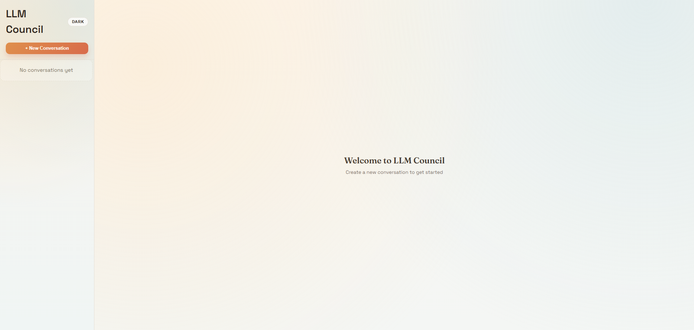
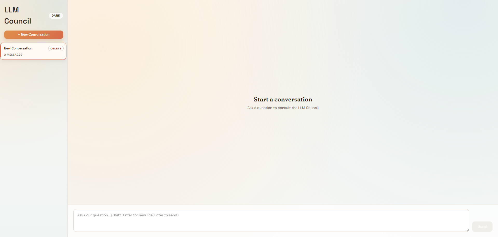
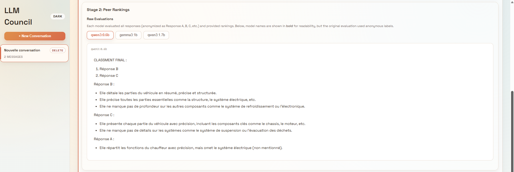
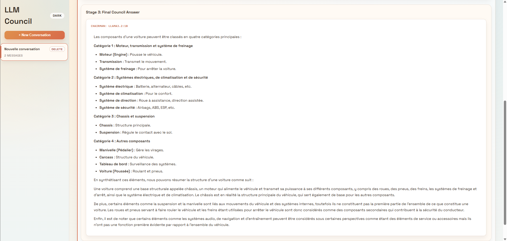

# LLM Council - Distributed Multi-Model AI System

[](https://www.python.org/)
[](https://fastapi.tiangolo.com/)
[](https://reactjs.org/)
[](https://www.docker.com/)
[](https://ollama.ai/)

> [!NOTE] 
> **For detailed technical information**, see [TECHNICAL_REPORT.md](TECHNICAL_REPORT.md)

## Acknowledgments

**Inspired by:**
- Andrej Karpathy's LLM Council concept
- Multi-agent AI research (DeepMind, OpenAI, Anthropic)

**Built with:**
- [Ollama](https://ollama.ai/) - Local LLM infrastructure
- [FastAPI](https://fastapi.tiangolo.com/) - Modern Python web framework
- [React](https://react.dev/) - Frontend UI library
- [Docker](https://www.docker.com/) - Containerization platform

## Team Information

**Institution**: De Vinci Higher Education - Gen AI </br>
**TD Group**: CDOF2 </br>
**Submission Date**: January 2026 </br>

**Team Members**:
- Mathys D.
- Mathéo D.
- Edouard D.

## Project Overview

The **LLM Council** is a fully local, distributed multi-agent AI system that replaces single-model inference with collaborative decision-making. Instead of querying one AI model, the system orchestrates multiple locally-running models through a **three-stage deliberation process** to provide comprehensive, bias-reduced responses.

**Key Features**

- **Fully Local Execution** - No cloud APIs, all models run on your infrastructure
- **Distributed Architecture** - Designed to run across multiple machines via REST APIs
- **Containerized Deployment** - Docker Compose orchestration for easy setup
- **Ollama Integration** - Leverages Ollama for efficient local LLM hosting
- **Modern Web UI** - React-based interface with conversation management
- **Async Processing** - FastAPI backend with concurrent model querying
- **Conversation Storage** - Persistent JSON-based conversation history
- **3-Pane Interface** - View all model responses, reviews, and final synthesis

**Three-Stage Deliberation Process :**

```
┌─────────────────────────────────────────────────────┐
│ STAGE 1: Initial Analysis (Parallel Execution)      │
│       ┌─────────┐  ┌─────────┐  ┌─────────┐         │
│       │ Llama   │  │ Gemma   │  │  Phi3   │         │
│       │ 3.2:1b  │  │ 2:2b    │  │ 3:3.8b  │         │
│       └────┬────┘  └────┬────┘  └────┬────┘         │
│            │   Independent Responses │              │
└────────────┼────────────┼────────────┼──────────────┘
             └────────────┼────────────┘
                          ▼
┌─────────────────────────────────────────────────────┐
│ STAGE 2: Peer Review (Cross-Evaluation)             │
│ Each model anonymously ranks others' responses      │
└─────────────────────────┬───────────────────────────┘
                          ▼
┌─────────────────────────────────────────────────────┐
│ STAGE 3: Final Synthesis (Chairman Model)           │
│        Consolidates all perspectives                │
└─────────────────────────────────────────────────────┘
```

## Prerequisites

- **1 Host** : required, run front-end, backend and ollama instance with chairman and 0+ councilor models
- **0-N Remote** : optional, run ollama instance with 0+ councilor models
- **Local network connectivity** between machines (if using remote ollama instances)

**System Requirements:**

|    Component     |               Minimum               |    Recommended   |
|------------------|-------------------------------------|------------------|
| **CPU**          | 4 cores                             | 6+ cores         |
| **RAM (Host)**   | 8GB                                 | 12GB+            |
| **RAM (Remote)** | 8GB per Remote                      | 12GB+ per Remote |
| **Storage**      | 15GB free                           | 25GB+ free       |
| **Network**      | 100Mbps LAN                         | Gigabit LAN      |
| **OS**           | Windows 10, Ubuntu 20.04, macOS 12+ | Latest versions  |

Also, you can allow Docker to use GPU, with the appropriate NVIDIA driver, see [ollama online instructions](https://docs.ollama.com/docker). __This has not been tested on our project.__

## Project Structure

```
gen-ai-project/
│
├── backend/                     # Python, FastAPI backend, configure LLM models & connections
│
├── frontend/                    # JavaScript, React web interface for user
│
├── docker-compose-ollama.yaml   # Host setup (front, back & ollama)
├── docker-compose-pipeline.yaml # Remote setup (ollama)
│
├── README.md                    # This file
└── TECHNICAL_REPORT.md          # Technical documentation
```


## Setup & Install

> **[H]** : Host configuration <br>
> **[R]** : Remote configuration

### 1. **[H/R]** Install Docker & Docker compose

- Install Docker : [Docker Desktop](https://www.docker.com/products/docker-desktop/)
- Install Docker compose : [Docker Compose](https://docs.docker.com/compose/install)

### 2. **[R]** Get network adresses for host configuration

Look for the **IPv4 Address** - something like `192.168.1.101` or `10.0.0.X`

- Windows :
```ps
ipconfig
```

- Linux / Mac : 

```bash
ip addr
```
### 3. **[H/R]** Clone the project

On **each machine**, clone the repository with :

```bash
git clone git@github.com:MAT34525/gen-ai-project.git
cd gen-ai-project
```

### 4. **[R]** Run remote ollama

Start ollama on remote machines with : 

```bash
docker compose -f docker-compose-ollama.yaml up -d
```

> [!IMPORTANT]  
> If models are not explicitely pulled, it will be done at the start of the host.</br>
> Yet,  the web UI will be unresponsive until all models are pulled.

> [!TIP]
> You can pull models prior to their usage to speed up the process using : 
>
> ```bash
> docker exec llm-council-ollama ollama pull llama3.2:1b
> ```

> [!TIP]
> You can checked available models using : 
>
> ```bash
> docker exec llm-council-ollama ollama list
> ```

### 5. **[H]** Configure the host

The host configuration is accessible in the `backend/config.py` folder.

> [!IMPORTANT]  
> The ip `ollama`reffers to the name of the container running locally, it is not an external IP.</br>
> Change `ollama` to a valid IP if the models runs on an other machine.


> [!TIP]  
> You can check available models names at : [ollama library](https://ollama.com/)
> **Exemple of models** (pull with `ollama pull <model-name>`):
> - Small (1-2B): `tinyllama:1.1b`, `qwen2:1.5b`, `gemma:2b`
> - Medium (7B): `llama3:7b`, `mistral:7b`, `qwen2:7b`
> - Large (13B+): `llama3:13b`, `mixtral:8x7b`

Complete settings in the file, you can add or remove models with :
```py
CouncilModel(
   ip=<ip>, # Host container : "ollama", Remote : valid IP, ex : "10.0.0.X"
   port=OLLAMA_PORT, # Default is 11434, change if required
   model_name=<model name>, # See ollama library, ex : "llama3.2:1b"
   role=<role> # Role.CHAIRMAN, Role.COUNCILOR
)
```

Add your models and connections setting in the `COUNCIL_MODELS` list :
```py
COUNCIL_MODELS = [

    # Chairman model (host only)
    CouncilModel(
        ip="ollama", # Local ollama container (resolved with docker dns)
        port=OLLAMA_PORT,
        model_name="llama3.2:1b",
        role=Role.CHAIRMAN
    ),

    # Council models (remote or host)
    CouncilModel(
        ip="ollama", # Set the IP of a remote  PC with running ollama
        port=OLLAMA_PORT,
        model_name="llama3.2:1b",
        role=Role.COUNCILOR

    ),
    CouncilModel(
        ip="ollama", # Set the IP of a remote PC with running ollama
        port=OLLAMA_PORT,
        model_name="gemma3:1b",
        role=Role.COUNCILOR

    ),
    CouncilModel(
        ip="ollama", # Set the IP of a remote PC with running ollama
        port=OLLAMA_PORT,
        model_name="phi3:3.8b",
        role=Role.COUNCILOR
    )
]
```

### 6. **[H]** Run the host

Once configured, you can run host containers with :

```bash
docker compose -f docker-compose-pipeline.yaml up -d
```

Once loaded, you will have access to : 
- Web UI at : http://localhost:5173
- Backend REST API at : localhost:8001
- Ollama API at : localhost:11434

> [!IMPORTANT]  
> If models are not explicitely pulled, it will be done at the start of the host.</br>
> Yet,  the web UI will be unresponsive until all models are pulled.

### 7. **[H/R]** Check connectivity

All ollama instances should be accessible on the network.

You can check access to remote ollama containers using : 

```bash
curl http://<IP>:11434/api/tags
```
> **IP** : IP of the remote host on the network.

**Success**:  You should see JSON output listing Remote's models  
**Failure**: Check firewall rules and network connectivity

## Demo

### 1. Create a New Conversation

- Click **"+ New Conversation"** in the left sidebar
- A new conversation appears with a timestamp ID



### 2. Submit a Test Query

- Type or paste the query in the text input area
- Click **"Send"** or press `Ctrl+Enter`
- Wait until the council to deliberate



### 3. Wait for response

On each machine(s), you can monitor progress of ollama :

```bash
docker logs -f llm-council-ollama-council
```

Or backend responses on the host and ongoing API calls: 

```bash
docker logs -f llm-council-backend
```

You'll see:
- Stage 1: Requests sent to Remote councilor models (and/or Host councilors)
- Stage 2: Peer review calculations
- Stage 3: Chairman model synthesis (always on Host)

### 4. Review Council Responses

The UI will display three tabs: 

**Stage 1: Initial Responses**
- Click to see individual analysis from each councilor model
- Models may be distributed across Host and Remote machine(s)
- Compare how different models identify different biases
- Notice diversity in reasoning approaches


**Stage 2: Peer Review**
- See how models ranked each other's responses
- Anonymous scoring prevents favoritism
- Highest-ranked response is highlighted



**Stage 3: Chairman Final Answer** (Default view)
- Consolidated synthesis combining all perspectives
- Generated by Chairman model (always on Host)
- Most comprehensive and balanced response
- References points from multiple models



### 5. Show Conversation History

- Click on previous conversations in the sidebar
- All messages and metadata are preserved
- Demonstrates persistent storage capability

## Troubleshooting

### Connection Error

**Symptom:** `curl http://<REMOTE_IP>:11434/api/tags` fails

**Solutions:**

1. Verify Remote IP address:
2. Check Ollama is running on Remote / Host :
   ```bash
   docker ps | grep ollama
   ```
3. Test port 11434 is open
4. Check firewall rule
5. Ensure Host and Remote are on same network subnet

### Model Not Found

**Solutions:**
1. Check yout internet connection
2. Pull the missing model on the appropriate machine:
   ```bash
   docker exec llm-council-ollama-council ollama pull <model name>
   ```

### Services Won't Start

**Solution:**

1. Check Docker is running:
   ```bash
   docker ps
   ```
2. View logs:
   ```bash
   # On Host
   docker compose -f docker-compose-ollama.yaml logs
   
   # On Remote
   docker compose -f docker-compose-pipeline.yaml logs
   ```
3. Restart Docker Desktop 

### Frontend Shows "Failed to Load Conversations"

**Solution:**

1. Check backend is running on Host:
   ```bash
   curl http://localhost:8001/
   ```

2. Restart backend:
   ```bash
   docker compose restart backend
   ```

### Out of Memory Errors

**Solutions:**

1. Increase Docker memory limit:
   - Docker Desktop → Settings → Resources → Memory
   - Set to at least 8GB on Host, 12GB on Remote
   - OR : Prune docker volumes

2. Use smaller models (edit `backend/config.py`)

3. Reduce number of councilor models

4. Distribute councilors across more Remote machines

## Generative AI Usage Statement

This project utilized the following AI tools during development:

- **Claude Sonnet 4. 5** (via GitHub Copilot)
  - Code refactoring and optimization | **models.py, council.py & config.py done by human**
  - Documentation generation | **reviewed, simplified and corrected by human**
  - Architecture design suggestions | **dockerfiles & docker-compose done by human**
  - Debugging assistance

- **GitHub Copilot**
  - Code completion (function descriptors and comments)
  - Boilerplate generation

All AI-generated content was reviewed, tested, and modified by the development team. 

_Written with the assistance of AI tools._