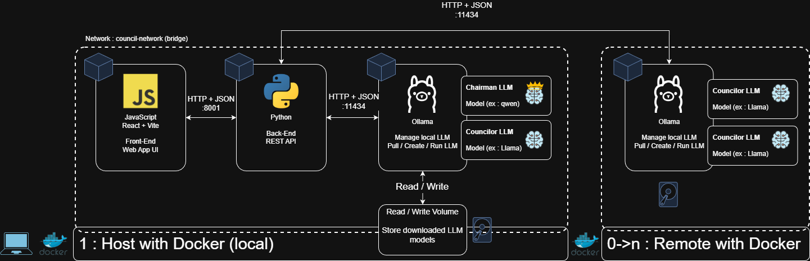

# LLM Council - Technical Report

**Project**:  LLM Council - Local Deployment with Distributed Architecture for Cognitive Bias Analysis </br>
**Based On:** [Andrej Karpathy's LLM Council](https://github.com/karpathy/LLM-council)   
**Date**: January 2026

## Team Information

**Institution**: De Vinci Higher Education - Gen AI </br>
**TD Group**: CDOF2 </br>
**Submission Date**: January 2026 </br>

**Team Members**:
- Mathys D.
- Mathéo D.
- Edouard D.

## Table of Contents

1. [Key Design Decisions](#key-design-decisions)
2. [Chosen LLM Models](#chosen-llm-models)
3. [Improvements Over Original Repository](#improvements-over-original-repository)
4. [Conclusion](#conclusion)

## Key Design Decisions

### 1. Open source & Local execution

**Decision** : Use Ollama instead of OpenRouter

**Implementation** :
- Change OpenRouter for Ollama
- Update REST API calls based on [Ollama API](https://docs.ollama.com/api/introduction) 
- Change JSON payload content
- Create council.py and dedicated class to handle Ollama connection and running LLMs

**Benefits** :
- Runs locally using Ollama
- Doesn't require API keys
- Doesn't require any subscription
- Can run offline

### 2. Distributed Execution

**Decision** : Distribute Ollama instances among machines on the same local network

**Implementation** :
- Created models.py to handle LLM config.
- Create enums to configure models roles and status.
- Added IP and port specification support.
- Updated config.py to handle new configuration requirements.
- Also added support to build new LLMs models based on system prompt.
- Exposed machine ports for Ollama / backend to allow REST calls
- Updated architecture, see below

**Architecture** :



- **Host Machine** (Control Node):
  - **Always runs**:  Chairman model (required for Stage 3 synthesis)
  - **Always runs**: Backend API + Frontend UI (orchestration and user interface)
  - **Can optionally run**: 0+ councilor models
  
- **Remote Machine(s)** (Compute Nodes):
  - **Runs**:  0+ councilor models each
  - **Scalable**: Add as many Remote machines as needed
  - **Role**: Provides distributed computational capacity

**Benefits** :
- Allow the host to run the pipeline (standalone) : front + back + ollama with 1 chairman & 0+ councilors
- Allow remotes to run ollama : ollama with 0+ councilors
- The host can distribute LLMs request to remotes machines
- Distribute processing power between multiple computers.
- Can run in standalone & distributed modes

### 3. Containerisation

**Decision** : Use Docker to build, load and run the project

**Implementation** :
- Create dockerfiles for frontend, backend and ollama
- Create docker-compose file for host and for remote
- Created dedicated network and volumes for the containers
- Exposed containers ports for backend & ollama

**Benefits** :
- Runs ollama without requiring a full installation
- Runs easilly, simple configuration, update and build
- Scalability

### 4. Three-Stage Deliberation Process

**Decision**: Use a multi-stage process (Initial Response + Peer Review + Synthesis).

**Implementation**:
- Backend manages the query & reception of individual answers
- Anonymous peer-review
- Independant synthesis

**Architecture**:

```
┌─────────────────────────────────────────────────────┐
│ STAGE 1: Initial Analysis (Parallel Execution)      │
│       ┌─────────┐  ┌─────────┐  ┌─────────┐         │
│       │ Llama   │  │ Gemma   │  │  Phi3   │         │
│       │ 3.2:1b  │  │ 2:2b    │  │ 3:3.8b  │         │
│       └────┬────┘  └────┬────┘  └────┬────┘         │
│            │   Independent Responses │              │
└────────────┼────────────┼────────────┼──────────────┘
             └────────────┼────────────┘
                          ▼
┌─────────────────────────────────────────────────────┐
│ STAGE 2: Peer Review (Cross-Evaluation)             │
│ Each model anonymously ranks others' responses      │
└─────────────────────────┬───────────────────────────┘
                          ▼
┌─────────────────────────────────────────────────────┐
│ STAGE 3: Final Synthesis (Chairman Model)           │
│        Consolidates all perspectives                │
└─────────────────────────────────────────────────────┘
```

**Benefits** :
- Reducing individual model biases and groupthink.
- Synthesis consolidates the best insights from all councilor models
- User can monitor each stage

## Chosen LLM Models

### 1. Selected Models

|     Role        |     Model     | Parameters | RAM Usage |    Location    |                      Usage                            |
|-----------------|---------------|------------|-----------|----------------|-----------------------------------------------------------|
| **Chairman**    | Qwen 2.5:1.5b | 1.5B       | ~2GB      | Always on Host | Fast synthesis, good at consolidating multiple inputs     |
| **Councilor 1** | Llama 3.2:1b  | 1B         | ~1.5GB    | Host or Remote | Meta's latest small model, strong reasoning for size      |
| **Councilor 2** | Gemma 2:2b    | 2B         | ~3GB      | Host or Remote | Google's model, different training approach than Llama    |
| **Councilor 3** | Phi3:3.8b     | 3.8B       | ~5GB      | Host or Remote | Microsoft's research model, deepest analysis of the three |

Main considerations : 
1. **Size**: Small enough to run on consumer hardware (1-4B parameters)
2. **Diversity**: Different architectures and training approaches to maximize perspective variety
3. **Performance**: Good reasoning capabilities for bias detection tasks
4. **Availability**:  Free and open-source models available via Ollama


### 2. Models Description

**Qwen 2.5:1.5b**
- **Synthesis-Optimized**: Qwen models excel at summarization and consolidation tasks. 
- **Multilingual**: Good performance in multiple languages (useful for non-English queries).
- **Small Size**: 1.5B parameters means fast inference for the final synthesis step.
- **Recent Training**: Qwen 2.5 has more recent training data compared to older Llama versions.

**Llama 3.2:1b**
- **Architecture**: Meta's transformer-based architecture
- **Strengths**: Good at identifying social and authority biases
- **Inference Speed**: ~2-3 seconds per query (CPU)
- **Can run on**: Host and/or Remote machines

**Gemma 2:2b**
- **Architecture**: Google's Gemini-inspired architecture (distilled)
- **Strengths**: Strong at logical fallacy detection, questioning assumptions
- **Inference Speed**:  ~4-5 seconds per query (CPU)
- **Can run on**: Host and/or Remote machines

**Phi3:3.8b**
- **Architecture**: Microsoft Research dense transformer
- **Strengths**: Most comprehensive analysis, best at complex reasoning
- **Inference Speed**: ~8-10 seconds per query (CPU)
- **Can run on**: Host and/or Remote machines

### 3. Models Combination

The diversity in model size and architecture is intentional: 
- **Llama 3.2** provides fast, concise analysis
- **Gemma 2** offers a different architectural perspective
- **Phi3** adds depth with its larger parameter count

This ensures the council doesn't suffer from "groupthink" - if all models were the same architecture (e.g., 3 Llama models), they might share similar biases. 

**Distribution Flexibility**: 
- **Recommended for demo**: All 3 councilors on Remote, chairman on Host
- **Alternative**: 1-2 councilors on Host, 1-2 on Remote
- **Advanced**:  Councilors distributed across multiple Remote machines

### 4. Alternative Models Considered

|     Model      |                          Non-selection explaination                                      |
|----------------|-------------------------------------------------------------------------------|
| Mistral 7B     | Too large for Remote to run 3 instances simultaneously (would need 24GB+ RAM) |
| TinyLlama 1.1B | Lower quality responses, less suitable for bias detection                     |
| Llama 3:8B     | Excellent quality but too slow for demo (15-20 seconds per query)             |
| GPT-4 via API  | Against project requirement of local-only execution                           |


## Improvements Over Original Repository

This project is based on the concept of LLM councils but has been significantly refactored and improved with the expected requirements.

### 1. Architecture

**Monolithic to Distributed setup** :

- **Original**:  Monolithic single-machine setup  
- **Our Improvement**: 
  - Distributed multi-machine architecture
    - Host : 1 with chairman model + Backend + UI 
    - Remote : 0+ with councilor models
- **Benefits**:
  - Better resource utilization across multiple machines
  - Demonstrates real-world distributed AI systems
  - Easier to scale horizontally by adding more Remote machines
  - Flexible:  works with 1 machine (Host only) or N machines (Host + Remotes)

**Cloud to local** :
- **Original**: Cloud API-based (OpenRouter)  
- **Our Improvement**:  
  - Fully local with Ollama
  - Allowed connection to machines on local network
  - Refined configuration support
- **Benefits**: 
  - No API costs
  - Complete data privacy (data never leaves local network)
  - Works offline after initial setup
  - Educational value in learning local LLM deployment and distributed systems

**Sequential to Parallel execution** :
- **Original**:  Synchronous, sequential model querying  
- **Our Improvement**:  
  - Async/await parallel execution in Stage 1, 
  - Queries distributed across Host and Remote machines concurrently
- **Benefits**: 
  - Stage 1 now takes ~10 seconds instead of ~30 seconds (N models queried in parallel across machines)
  - Better server responsiveness
  - Modern Python best practices
  - Efficient network utilization

**Sequential to Parallel execution** :
- **Original**:  Synchronous, sequential model querying  
- **Our Improvement**:  
  - Async/await parallel execution in Stage 1, 
  - Queries distributed across Host and Remote machines concurrently
- **Benefits**: 
  - Stage 1 now takes ~10 seconds instead of ~30 seconds (N models queried in parallel across machines)
  - Better server responsiveness
  - Modern Python best practices
  - Efficient network utilization

### 2. Feature Additions Summary 

|            Feature              |      Original       |                   Our Implementation                           |
|---------------------------------|---------------------|----------------------------------------------------------------|
| **Ollama support**    | Open Router | Allow user to pull any model from ollama and run it locally (host or remote) |
| **Distributed Architecture**    | Single machine only | Host with 0+ remote with flexible model selection & distribution |
| **Web UI**                      | CLI only            | Modern React interface with 3-pane view, reviewed from original                        |
| **Peer Review Visualization**   | Not shown           | Stage 2 tab shows all rankings and scores                      |
| **Docker Deployment**           | Manual setup        | One-command deployment per machine with docker-compose         |
| **Network Configuration**       | Local only          | Configurable IPs for distributed deployment across machines    |
| **Flexible Model Distribution** | None                 | Configure which models run on Host vs.  Remote(s)              |

## Conclusion

The LLM Council project successfully demonstrates: 

- **Distributed AI Architecture**:  Multi-machine deployment (Host + 0 to N Remote) with proper network configuration  
- **Flexible Model Distribution**: Chairman always on Host, councilors distributed as needed  
- **Local-First Approach**: Privacy-preserving, cost-free inference with Ollama on each machine  
- **Multi-Agent Collaboration**: Three-stage deliberation process reduces bias through distributed consensus  
- **Modern Tech Stack**: Docker, FastAPI, React, async Python with network communication  
- **Research Platform**: Data collection for studying AI bias reduction in distributed systems  
- **Practical Application**:  Working tool for cognitive bias detection

### Key Contributions

1. **Educational**:  Students learn distributed AI, local LLM deployment, async programming, containerization, and network configuration
2. **Research**: Platform for studying multi-model bias reduction and consensus-based AI across distributed systems
3. **Practical**:  Usable tool for analyzing text for cognitive biases and logical fallacies
4. **Scalable**: Architecture supports 1 to N machines with flexible model distribution

### Architecture Benefits

- **Host-centric design**: Chairman and orchestration always on Host ensures reliable synthesis
- **Scalable Remotes**: Add 0 to N Remote machines based on available hardware
- **Flexible distribution**: Councilors can run on Host, Remote, or both
- **Educational value**: Demonstrates real-world distributed AI architecture

### Future Improvements

- [ ] Secure REST API registration & communication
- [ ] GPU acceleration support on Remote machines
- [ ] Model health monitoring dashboard showing status of all machines
- [ ] Dynamic model registration via API (add/remove Remotes at runtime)
- [ ] Export conversations with machine attribution
- [ ] Weighted voting based on model confidence scores and machine performance

_Written with the assistance of AI tools._